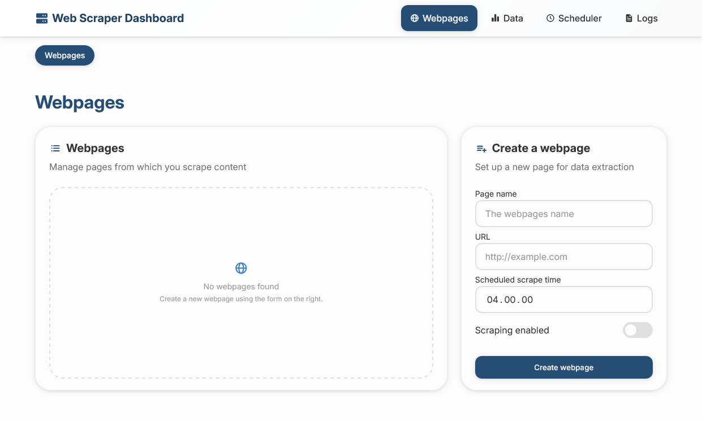

# Webpage Content Extractor

*This project was created as part of a university course.*

## About

This application lets you run a web-based scraper management system for collecting numeric values from webpages daily. It’s designed for simple setup and easy monitoring through a single WebUI. **You try out a demo of the application [here](https://scraper-demo.alkama.dev/).**

## Key features

### WebUI features
- Full management through a WebUI
  - Easy element picker
  - Enable/disable webpages
- Run manual scrapes
- View data visualizations
- View webpage- and element-level logs

### Automation
- Internal scheduling system
  - Custom scrape time per webpage
- robots.txt detection

### External triggers
- Optional POST-based scrape triggering for:
  - A specific webpage
  - All active webpages

## Local development

Each component has its own `README.md` with setup instructions.

## Deployment

Docker is used for deployment. The repository includes a template [`docker-compose.yml`](docker-compose.yml) and a [`stack.env.example`](stack.env.example) file. Copy the example to `.env` and adjust the settings before starting the stack.

## License

This project is licensed under the Apache License. See the [`LICENSE`](LICENSE) file for details.

<!-- ## Workflow & Collaboration

This project uses GitHub Issues and Branches to organize work and track progress. Follow these guidelines for effective collaboration:

### 1. Issues Board Usage
- **Create Issues:** For bugs, features, improvements, or questions, create an issue on the GitHub Issues board.
- **Describe Clearly:** Provide a clear title and description. Add labels (e.g., `bug`, `enhancement`, `question`) and assign to relevant team members.
- **Track Progress:** Move issues through stages (e.g., `To Do`, `In Progress`, `Review`, `Done`) using GitHub Projects or issue labels.
- **Close Issues:** Reference the issue in your pull request (e.g., `Fixes #12`) to automatically close it when merged.

### 2. Branch Usage
- **Main Branch:** The `main` branch contains stable, **production-ready** code. Do not commit directly to `main`.
- **Feature Branches:** Create a new branch for each issue or feature. Use a descriptive name, e.g., `feature/login-page` or `bug/fix-header`.
	- Branch from `main`.
	- Example: `git checkout -b feature/issue-12-content-extraction`
- **Commit Often:** Make small, focused commits. Reference the related issue in commit messages.
- **Merge & Delete:** Once approved and merged, delete the feature branch to keep the repository clean.

### 3. General Best Practices
- Keep your branches up to date with `main` by regularly pulling changes.
- Communicate in issues and PRs for transparency.
- Use clear commit messages and PR descriptions. -->
